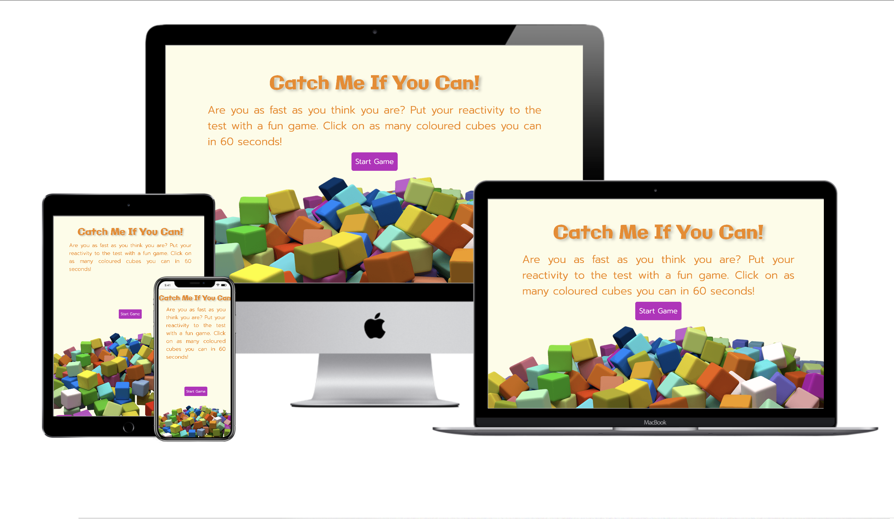
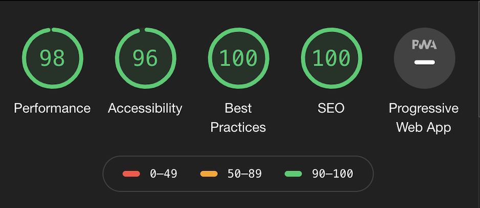
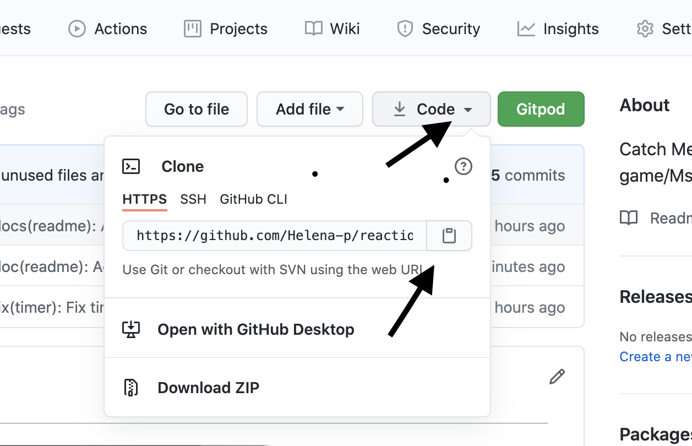

# Catch Me If You Can
Catch Me If You Can is a game to test the player's reaction time.  In a playful setting, the goal is for the player to 
click on as many items possible before the set timeframe of the game ends. The target items will show themselves randomly 
on the webpage, in position as well as within various time intervals. The score is based on the reaction time.

Follow this link to play the [game](https://helena-p.github.io/reaction-game)

---
## Table of Contents
- [UX](#ux)
- [Features](#features)
- [Technologies Used](#technologies-used)
- [Testing](#testing)
- [Deployment](#deployment)
- [Credits](#credits)
- [Acknowledgements](#acknowledgements)


---
## UX
I aim to present a game that is easy to understand and play for all ages. The game is presented on a mobile-friendly and 
easy to navigate web site. Accessible on all platforms to play the game on the go, or in the comforts of their home.

On entering the website the player shall directly understand how to play the game and the positive expected outcome by a 
welcoming text centered on the page. The headline is stating the purpose of the game and the centered start button, visually enforced by a stark 
 contrasting color, show how to engage with the game.

 While playing, the player can see the score increase as well as the reaction time between each "clicked" target. 
 My intention is that the player is given instant feedback on their performance to motivate interaction with the game.

 The game ends after 60 seconds and a pop-up box display the final score with the option to resume the game.

***Player 1***
 > *I am a new player and I want to spend some short offtime while playing a fun game to test my performance in some way. 
 I want to have some interaction with the game to feel motivated to keep playing. I want to feel challenged and have the 
 ability to improve my score.*

***Player 2***
 > *I am a frequent player and I want to improve my score and reaction-time. I compare my score with friends and family and share my results
 on my social pages.*

### Design 
I have chosen the typography Galindo because of its slight irregularity to give a sense of childish playfulness and gaming. The more 
contemporary typography Prompt is chosen to provide an easy to read and clear message to the player with a lighter font-weight.


The color palette is based on the image of multicolored cubes on the landing site and used throughout the web site to be consistent with the theme.
The bright colors with stark contrast are used to enhance the visual hierarchy and guide the player on how to navigate on the web site.

The web site is kept minimalistic in its features to mediate a modern, timeless feeling and not to be perceived as cluttered.


To view wireframes please click [here](assets/resources/reaction-game_ms2.pdf).

---
## Features
The web application is designed to be mobile-friendly and responsive on all screen sizes.

### Existing Features
**Start Game Button** 
<br>Allows players to start interacting with the game. The button triggers the timer to initiate the 60 seconds countdown and 
the function to show target items on the page.<br>

**Target Items**
<br>Is randomly positioned on the page at various intervals. When clicked the score will increment by 10 
if the target items are clicked within 1 second, and by 5 if the item is clicked over 1 second. The player will be
able to follow the time difference between each clicked item which is updated at the bottom of the gameboard.<br>

**Timer**
<br>Closing to end of game time the timer visually enhances this by changing color to yellow followed by red.<br>

**Modal**
<br>A modal pop up when the game end and will show the player his or her total score. The player is given the 
option to resume the gameby clicking on the restart game button. The button have a hover effect to visually 
strengthen the respond to the users activity.

### Future Features
- Optimise user experience in older versions of Safari.
- Debugg target items overflowing game-board at certain instances.
- Levels of difficulty by offering three sets of timeframes (beginner, intermediate, and advanced).
- Some target items of a certain color decrease the score when clicked. The player needs to be fast and attentive.
- A scoreboard for players to register their score and compare it with others on the web page.
- Links to social media to share your score with family and friends.

---
## Technologies Used

#### Languages
- HTML5
- CSS3
- Javascript
#### Other teqnologies
- [Basic Syntax Markdown Guide](https://www.markdownguide.org/basic-syntax/#unordered-lists)
- [Google Fonts](https://fonts.google.com/)
- [Adobe Color](https://color.adobe.com/sv/create/color-wheel)
- [Grammarly](https://www.grammarly.com/) Text editor
- [Balsamiq Wireframes](https://balsamiq.com/)
- [Tiny.png](https://tinypng.com/)
- [Pixabay](https://pixabay.com/)
- [Techsini Mockup Generator](http://techsini.com/)

---
## Testing
### Manual Testing
The manual testing have been performed in Google Chrome, Safari, Mozilla Firefox and Edge on a MacBook Pro 13". Testing for responsiveness has been made in
 dev tools continously throughout the building process.<br>
In older versions of Safari there is not an optimal user experience where the start button and pop-up
modal is too big and border-radius is extensive.

Manual testing made by family members on various devices and screen sizes. A problem with landing site on a Iphone 6s where the page was 
overflowing in height and didn't scroll.

**Features**
- Start button tested in various screen sizes and browsers. The start button responds to satisfaction and hover effect
is clearly visible.
- Timer is tested in various screen sizes and browsers. It starts and measure correct time (60 seconds), display given intervals 
of 10 seconds left in yellow colour and 5 seconds left in red correctly. The timer also start and display correctly after restart of game.
- Userscore display when game starts and correctly increment the score of 10 and 5 points depending how fast the player click on target items.
Userscore also display correctly after restart of game. Userscore is correctly displayed in modal after game end with correct total score.
- Reactivity score is displayed after two target items have been clicked and continue to measure time elapsed between clicked items during game.
- Target items is displayed when game starts and are shown in random interval, in random positions and in random sizes. The interval is stopped 
when timer end still displaying one target item. Some target items is causing an overflow in some screen sizes which makes the page jump. This
is due to Domrect incorrect sizing of viewport and is **not** to satisfaction.
- Modal is displayed at end of game, centered in page. Total score is displayed correctly. 0 score is not displayed. Restart game button
is functional and tested in various screen sizes and browser. The button with its hover effect is displayed to satisfaction. When restart button is clicked
the home page is refreshed with no delay.
- The project was deployed and shared at Code Institute peer-code-review with the only feedback of the target items causing overflow on page.
- Testing all links in documentation is correct with no errors.

### Validators used

- Lighthouse Test Response<br>
I access Lighthouse by ```shift + cmd + i``` (Mac) or either ```F12``` or ```ctrl + shift + i``` (windows) alternatively 
by right-clicking on the web page to open up Chrome dev tools. I access Lighthouse in the top menu dropdown list and
select generate report.

<br>
[Full image can bee seen here](assets/images/large-lighthouse.png)

Issues solved<br>
Decompressing main image to 74 K and added meta descrition to HTML ```<head>``` tag.

- [Techsini](http://techsini.com/) responsive test and mockup generator
- [Troy](http://troy.labs.daum.net/) responsive test
- [Autoprefixer](https://autoprefixer.github.io/)
- [HTML Validator](https://validator.w3.org/)
- [CSS Validator](https://jigsaw.w3.org/css-validator/)<br>
 <br>
- [JsHint](https://jshint.com/)<br>
Returned errors<br>
Two undefined variables  - app, currentScore<br>
Multiple comment - 'const' is available in ES6 (use 'esversion: 6') or Mozilla JS extensions (use moz).<br>
4 mentions - template literal syntax' is only available in ES6 (use 'esversion: 6').<br>
12 mentions - 'let' is available in ES6 (use 'esversion: 6') or Mozilla JS extensions (use moz).<br>

I pasted ```/*jshint esversion: 6*/``` at the top of the javascript file to show which version I am using.<br>

- [Google Mobile Friendly](https://search.google.com/test/mobile-friendly?id=TjAExRUXFnhWfhViLsbwyw) test
- [GTmetrix](https://gtmetrix.com/reports/8000-d49eb34e-4f68-4259-ab33-a1635c419110.ws-eu01.gitpod.io/GxTiMqyc) To test speed and loading time
- [WebAim](https://webaim.org/resources/contrastchecker/?fcolor=B9652D&bcolor=FDFCE7) Contrast checker
- [Pineberry](https://www.pineberry.com/analysverktyg/resultat/Vw8vYZpv4xY_/) online SEO tester

### Known bugs
- Main image on landing page is on some screen sizes causing an overflow. When the game is in play 
the image is hidden and therefor do not have an effect on the game itself. 
- Target items is in some positions overflowing which causes the page to jump. This is due to incorrect sizing of viewport by DomRect and
getBoundingClientRect in main.js. Improved performance by deleting 'wildcard' (margin and padding set to 0) in stylesheet css. Although 
bug still remains.
- Older versions of Safari have a bug when scaling with percentages and rem units in desktop view causing the start- and restart button to
oversize and an excessive border-radius. Cause of action would be to change units to px. Added Media Query to override
certain webkits for Safari, IE and Edge.
- Older versions of Safari have problems with displaying png images.
---
## Deployment

Following steps were taken to deploy my project to GitHub Pages:

- Logged in to GitHUb account and selected the repository to deploy.
- Locate the 'Settings' button in the meny bar above the repository and scroll down to 'GitHub Pages'.
- In the drop-down meny directly beneath 'Source', select 'master branch'. The page will refresh automatically.
- Locate the deployed link in the repositorys main 'GitHub Pages'section.

Following steps will be taken to fork the repository, to update or make changes to the repository:

- Login to my GitHub account and repository page.
- Locate the 'Fork' button in the top right corner of the page, above 'Settings'.
- Clicking the "Fork' button gives me a copy of the repository in my GitHub account.

Git Clone

The "clone" command downloads an existing Git repository to a local computer.
There are different options for cloning a repository, but this walkthrough will only cover the Url option, which is the most frequently used
option. You need to have downloaded and installed Git on to your computer. Make sure to allow Git to be used from the command line 
in the installation process.

- Create a folder for storing the repository locally.
- Open your web browser and enter the GitHub repository’s URL.
- Click on the button, “Code”, on the right side of the screen, below the “Security” tab<br>



- Open the Command Prompt (on Windows) or Terminal (on Mac).
- In the terminal, navigate to the location in which you would like to store the repository by typing the following command:

```$ cd <name of directory>``` 

- To clone the repo. Enter the following command:

```$ git clone <name of repo-url>```

- Make sure that the repository is in the dedicated folder on your computer. If so, then the repository was 
successfully cloned to your “Git local” folder.

For a full tutorial or to find other options to clone a repository than by Url, 
please visit this [Git Tutorial](https://www.atlassian.com/git/tutorials/setting-up-a-repository/git-clone).

---
## Credits
- [Udemy Javascript course](https://www.udemy.com/course/javascript-training/) by Laurence Svekis.
<br>*Foundation for the game. Modified for suitability with other features such as end game, score counter and timer*
- [CSS-Tricks Animated Countdown Timer](https://css-tricks.com/how-to-create-an-animated-countdown-timer-with-html-css-and-javascript/)
- [SABE Modal Pop Up Box](https://sabe.io/tutorials/how-to-create-modal-popup-box)
<br>*Modified to be activated by timer instead of button.*
- Code Institute LMS
<br>*General source of information*
- Stack Overflow, W3School, Mozilla MDN
<br>*General source of information and troubleshooting*
- Code Institute Slack Channel<br>
Source of information and troubleshooting
- [Atlassian Bitbucket](https://www.atlassian.com/git)
<br>*General source of information.*
- Indrek Paas, CodePen
<br>*Source for Media Query to override older browser versions of Safari, IE and Edge to adapt
% and rem units for scaling.*
- Antonio Rodriguez, my mentor, general support and assistance in finding solution to end game.

### Content
The textual content is written by myself, Helena Plantin.
### Media
The images used in this project were obtained from [Pixabay](https://pixabay.com/).

---
## Acknowledgements
I received inspiration and based the foundation for this project while attending a 
[Udemy Javascript course](https://www.udemy.com/course/javascript-training/) by Laurence Svekis.
<br>I especially want to say thank you to Antonio Rodriguez, Mentor, for outstanding support. Also,
my partner in life, Patrick Svensson.